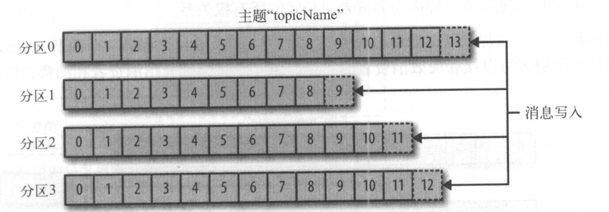
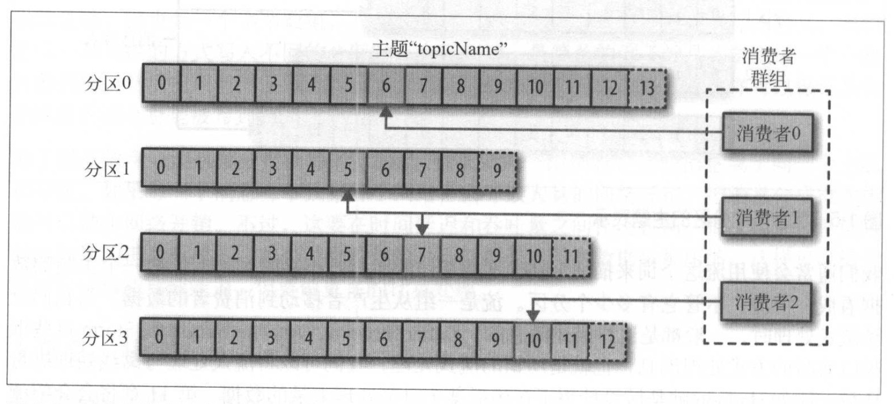
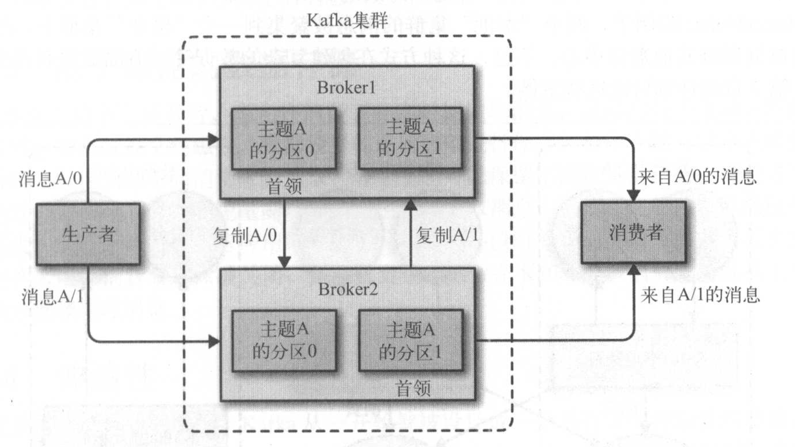

# 1. 初始Kafka

## 1.1 发布式与订阅消息系统

 - 数据（消息）的发布者不会直接把消息发送给接受者
 - 发布者以某种方式对消息进行分类；接受者（订阅者）订阅他们，以便接收特定类型的消息。
 - 一般会有一个broker

## 1.2 Kafka 登场

 - 一般被称为“分布式提交日记“或“分布式流平台”
 - 文件系统或数据库提交日记用来提供所有事物的**持久化**保存的，通过**重放**这些日记可以重建系统的状态。

### 1.2.1 消息和批次

 - Kafka的数据单元被称为**消息**；也可以把消息看成是数据库理的一个”数据行“或一条”记录”
 - 消息包含一个**键**；分区器为键生成一个一致性的散列值(hash value)，然后使用散列值对主题分区进行取模（module：hash_value % num_topics = topic_to_save_data)
   - 这样可以保证具有相同键的消息总是被写到相同的分区上。
 - 为了提高效率及减少网络开销，消息被分批次写入(batch write，根据同一个主题和分区）kafka
   - 要在时间延迟和吞吐量之间作出平衡
   - 批次数据会被压缩

### 1.2.2 模式

 - skip

### 1.2.3 主题和分区

 - Kafka的消息通过**主题**进行分类，每个主题分成若干个**分区**，一个分区就是一个**提交日记（commit log）
 - 消息以追加的方式写入分区（append)，然后以先入先出（FIFO）的顺序读取
   - 分区可以分布在不同的服务器上，也就是说，一个主题可以横跨多个服务器。

 - 通常用**流**这个词来描述kafka的数据；流式处理是一种实时处理消息的方法。

### 1.2.4 生产者和消费者

 - Kafka的客户端：生产者和消费者，及其他高级客户端API（如Kafka Connect API和Kafka Streams）
 - **生产者**在默认情况下把消息均衡分布到主题的所有分区上，而并不关心特定消息会被写到哪个分区。
   - 不过，在某些情况下，还是会把消息直接写到指定的分区。
 - **消费者**读取数据；订阅一个或多个主题，并按照消息生成的顺序读取他们
   - 消费者通过检查消息的**偏移量**（一个不断递增的整数值）来区分已经读过的消息。
   - 消费者是消费者群组的一部分；群组保证**每个分区只能被一个消费者使用**。
     - 如果一个消费者失败，群组理的其他消费者可以接管失效消费者的工作。

### 1.2.5 broker和集群

 - broker
   - 是kafka的服务器
   - 接收来自生产者的信息，为消息设置偏移量，并提交消息到磁盘保存。
   - 为消费者提供读取服务，**读取分区并返回**已经提交到磁盘的消息。
 - 每个集群都有一个broker充当**集群控制器**的角色 
   - 控制器负责管理工作，包括将分区分配给broker和监控broker
 - 每个集群中，一个分区属于一个broker，该broker被称为分区的**首领**
   - 一个分区可以透过分区复制（replication）分配给多个broker；如果有一个broker失效，其他broker可以接管领导权。

 - kafka会在一定期限内保留消息；有两个保留策略：
   - 保留一段时间（比如7天）
   - 保留到消息达到一定大小的字节数（比如1GB）
     - 当消息数量达到上限，旧消息就会过期并被删除。

 - 主题可以配置自己的保留策略
   - 例如：有些数据只需要保留几个小时，有些就需要几个礼拜；按照数据决定保留策略

### 1.2.6 多集群

 - 随着kafka部署数量的增加，基于以下的原因，最好使用多个集群：
   - 数据类型分离
   - 安全需求隔离
   - 多数据中心（灾难恢复）

 - 要用kafka所提供的**MirrorMaker**工具才可以实现**集群间的信息复制**

## 1.3 为什么选择kafka？

 - 多个生产者
 - 多个消费者
   - 在其他队列系统理，消息一旦被一个客户端读取，其他客户就无法再读取他。kafka不是这样的
 - 基于磁盘的数据存储
   - 持久化
 - 伸缩性
   - 可以包含一个broker，也可以包含上百个broker
 - 高性能
  - 通过横向扩展生产者，消费者和broker

