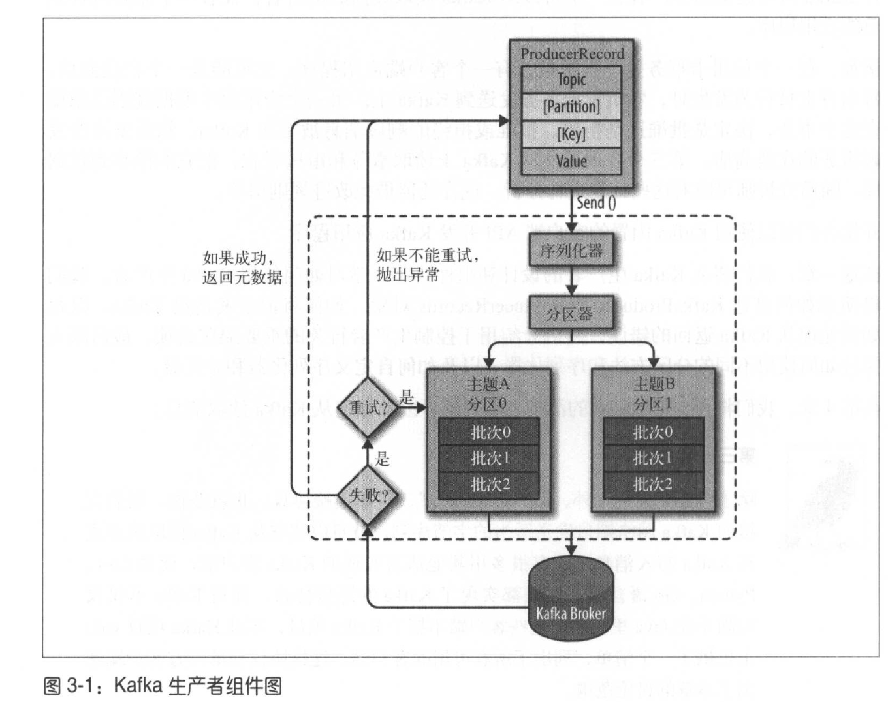
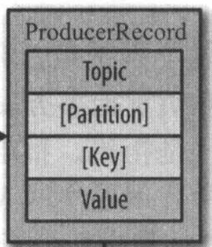
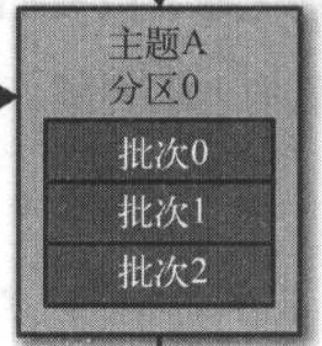

# 3. Kafka生产者
 - 从kafka生产者的设计和组件讲起，学习如何使用Kafka生产者。
 - 演示如何创建KafkaProducer和ProducerRecords对象？
 - 演示如何将记录发送给Kafka？
 - 演示如何处理从Kafka返回的错误
 - 介绍用于控制生产者行为的配置选项
 - 深入讨论如何使用不同的分区方法和序列化器
 - 如何自定义序列化器和分区器

## 3.1 生产者概览



1. `ProducerRecord`对象需要包含主题和要发送的内容；我们还可以定义键或分区。


2. 发送`ProducerRecord`时，需要把键和值序列化成字节数组；这样才可能在网络上传输。
3. 数据被传给分区器
   - 如果ProducerRecord对象指定了分区，那么分区器直接把指定的分区返回
   - 如果没有定义分区，那么根据ProducerRecord的键选择分区。

4. 记录被添加到一个记录批次里(**TODO: Don't fully understand here!!**)，这个批次里的所有消息会被发送到相同的主题和分区上。
   - 有一个独立的线程负责把记录批次发送到相应的broker上



5. 服务器（Kafka Broker）收到这些消息时会返回一个响应。
   - 如果消息成功写入Kafka，就返回一个`RecordMetaData`对象，它包含主题，分区信息和记录在分区里的偏移量。
   - 但如果写入失败，则返回一个错误。生产者在收到错误后会尝试发送消息，几次之后如果还是失败，就返回错误信息。 (**TODO: kind of confusing...so immediately return Exception or only after retries?**)

## 3.2 创建Kafka生产者

 - 要往Kafka写入消息，首先要创建一个生产者对象，并设置一些属性。
 - Kafka有3个比选的属性：

**1. bootstrap.servers**
 - 指定broker的地址清单，地址格式为`host:port`
 - 清单不需包含所有broker，生产者会从给定的broker查找到其他broker的信息
 - 建议至少填两个；万一一个宕机

**2,3. key.serializer和value.serializier**
 - broker接收的消息的键和值可以是字节数组或者一个Java对象。
 - `key.serializier`必须设置为一个实现了`org.apache.kafka.common.serialization.Serializer`接口的类；生产者会使用这个类把键对象序列化成字节数组。
 - Kafka客户端默认提供了`ByteArraySerializer`,`StringSerializer`和`Integerserializier`。
 - 注意：key.serializer是必须设置的，就算你只发送值内容（不发送键）

**Demo**

```java
private Properties kafkaProp = new Properties();
kafkaProps.put("boostrap.servers", "broker1:9092,broker2:9092");
kafkaProps.put("key.serializer", "org.apache.kafka.common.serializier.StringSerializer");
kafkaProps.put("value.serializer", "org.apache.kafka.common.serializier.StringSerializer");

producer = new KafkaProducer<String, String>(kafkaProps);
```

## 3.3 发送消息到Kafka

**发送函数介绍**

 - 有三种：

1. 发送并忘记（fire-and-forget)
   - 发送后，我们不关心是否正常到达
   - 大部分情况下，消息会正常到达，因为Kafka是高可用的，而且生产者会自动尝试重发

2. 同步发送
   - 使用`send()`发送消息会返回Future对象；然后调用`get()`方法进行等待

3. 异步发送
   - 调用`send()`并指定一个回调函数。

**代码演示**

 - 最简单的消息发送方式：

```java
// ProducerRecord有多个构造函数，这只是其中一个
ProducerRecord<String, String> record = new ProducerRecord<>("TopicSample", "KeySample", "ValueSample"); 

try {
  // 消息先被放进缓冲区，然后使用单独的线程发送到服务器。
  // send()函数返回Future对象
  producer.send(record);
} catch (Exception e) {
  e.printStackTrace();
}
```

### 3.3.1 同步发送消息

```java
ProducerRecord<String, String> record = new ProducerRecord<>("TopicSample", "KeySample", "ValueSample"); 

try {
  // 调用Future对象的get()等待Kafka的响应
  // 如果服务器返回错误，get()方法会抛出异常
  // 如果没有发生错误，我们会得到一个RecordMetadata对象，可以用它获取消息的偏移量
  producer.send(record).get();
} catch (Exception e) {
  e.printStackTrace();
}
```

 - KafkaProducer一般会发生两类错误；可重试解决的和不可重试解决的
   - 可重试解决的：
     - 例子：连接错误、"无主(no leader)"错误（可通过重新为分区选举首领来解决）
     - KafkaProducer可以被配置成自动重试，如果在多次重试后仍无法解决问题，应用程序会收到一个重试异常
   - 不可重试解决的：
     - 例子：”消息太大“异常
     - KafkaProducer不会进行任何重试，直接抛出异常

### 3.3.2 异常发送消息

```java
private class DemoProducerCallback implements Callback {
  // Callback接口的唯一方法
  @Override
  public void onCompletion(RecordMetadata recordMetadata, Exception e){
    // 如果Kafka返回错误，onCompletion会抛出一个非空（non null)异常
    if(e != null){
      e.printStackTrace();
    }
  }

  ProducerRecord<String, String> record = new ProducerRecord<>("TopicSample", "KeySample", "ValueSample");
  producer.send(record, new DemoProducerCallback());
}
```

## 3.4 生产者的配置

 - 以下是比较重要的一些生产者配置

**1. acks**
 - acks参数指定了必须有多少个分区副本收到消息，生产者才会认为消息写入是成功的。
 - 如果acks=0，生产者在成功写入之前**不会等待**任何服务器的响应
   - 因此，生产者有可能丢失了消息也不知道。
   - 同时，也因为这样，它可以达到最高的吞吐量。
 - 如果acks=1，只要集群的首领节点收到消息，生产者就会收到一个来自服务器的成功响应。
   - 如果消息无法达到首领节点（比如首领节点崩溃，新的首领还没有被选举出来），生产者会收到一个错误响应；为了避免数据丢失，生产者会重发消息。
   - 不过，如果一个没有收到消息的节点称为首领，消息还是会丢失。
   - 吞吐量：Future.get()显然最慢，使用异步方式表面上跟acks=0速度没差别，但有可能会受到发送中消息数量的限制。
 - 如果acks=all，只有当所有节点都收到消息，生产者才会收到响应。
   - 最安全的，但延时一定比acks=1高

**2. buffer.memory**
 - 设置生产者内存缓冲区的大小
 - 如果**应用程序发送消息的速度超过发送到服务器的速度**，会导致生产者空间不足。
 - 这个时候，`send()`方法调用要么阻塞，要么抛出异常；取决于如何设置`block.on.buffer.full`

**3. compression type**
 - 默认情况下，消息发送时不会被压缩
 - 该参数可以设置为snappy, gzip或lz4，
   - snappy压缩由Google发明，它占用较少的CPU，却能提供较好的性能和相当可观的压缩比；适合比较关注性能和网络带宽的情况
   - gzip压缩一般占用较多CPU，但会提高压缩比；所以适合网络有限时

**4. retries**
 - 生产者从服务器收到错误的根源有可能是临时的错误（比如分区找不到首领）
 - 这个时候，`retries`参数决定了生产者重发消息的次数；如果超出这个次数，生产者才会放弃并放回错误。
 - 默认情况下，生产者每次重试之间等待100ms；不过可以通过`retry.backoff.ms`参数更改时间间隔
 - 建议先测试恢复一个崩塌节点需要多少时间，以便让总的重试时间比Kafka恢复时间长，否者生产者会过早地放弃重试。

**5. batch size**
 - 当有多个消息需要发送到同一个分区时，生产者会把他们放进同一个批次。
 - 该参数定义一个批次可以使用的大小；按照字节数计算（而不是消息个数）
 - 当批次填满，批次理的所有消息会被送出去。
 - 不过生产者**不一定等到填满才送出去**（半满，一点点满也有可能送出去）
   - 因此，就算把批次大小设置得太大，只会占用更多的内存
   - 但如果设置得太小，生产者会更频繁地发送消息，从而增加额外的开销。

**6. linger.ms**
 - 该参数指定了生产者在发送批次之前等待更多消息加入批次的时间
 - 默认情况下，只要有可用的线程，生产者就会把消息发送出去，哪怕批次里只有一个消息。
 - 设置>0会增加时延但也会增加吞吐量

**7. client.id**
 - 该参数可以是任意的字符串，服务器会用它来识别消息的来源，还可以用在日志和配额指标里。

**8. max.in.flight.requests.per.connection**
 - 指定了生产者在收到服务器的响应之前可以发送多少个消息
 - 他的值越高，就会占用越多的内存，不过也会提升吞吐量。
 - 把参数设为1可以保证消息是按照发送的顺序写入服务器的，即使发生了重发

**9. timeout.ms, request.timeout.ms和metadata.fetch.timeout.ms**
 - `request.timeout.ms`指定了生产者在发送数据时等待服务器返回响应的时间
 - `metadata.fetch.timeout.ms`指定了生产者在获取元数据（比如目标分区的首领是谁）时等待服务器返回响应的时间。
 - 如果等待响应超时，那么生产者要么重试发送数据，要么返回一个错误
 - `timeout.ms`指定了broker等待同步副本返回消息确认的时间；与acks的配置匹配；如超时，broker会返回错误。

**10. max.block.ms**
 - 该参数指定了在调用`send()`方法或使用`partitionsFor()`方法获取元数据时生产者的**阻塞时间**。
 - 当生产者的发送缓冲区已满，或者没有可用的元数据，这些方法（send和partitionsFor)就会阻塞。
   - 在阻塞时间达到`max.block.ms`时，生产者会抛出超时异常。

**11. max.request.size**
 - 用于控制生产者发送的请求大小。
 - 他可以指发送的**单个消息的最大值**，也可以值**单个请求里所有消息总的大小**。
 - 例如：假设这个值为1MB：
   - 那么可发送的单个最大消息为1MB
   - 或者生产者可以在单个请求里发送一个批次，该批次包含了1000个大小为1KB的消息。
 - 另外，broker对接收的消息最大值也有自己的限制（`message.max.bytes`); 所以两边最好可以匹配。

**12. receive.buffer.bytes和send.buffer.bytes**
 - 这两个参数指定了TCP socket接收和发送数据包的缓冲区大小。
 - 如果被设为-1，就用操作系统的默认值。
 - 如果生产者或消费者与broker处于不同的数据中心，那么可以适当增大这些值，因为跨数据中心的网络一般都有较高的延时和较低的带宽。

**顺序保证**
 - 如果需要消息顺序，建议`retries > 0, max.in.flight.requests.per.connect = 1`。
 - 否者消息不一定顺序，例子：
   - 你有两个消息；A和B。A从生产者发到broker先，但由于写入失败需要等一会再重试发送。B紧接着A，所以在A重试之前已被发送到broker并被存储了。此时，A重试发送并成功地被存储。这个情况下，A-B顺序被打乱了。


