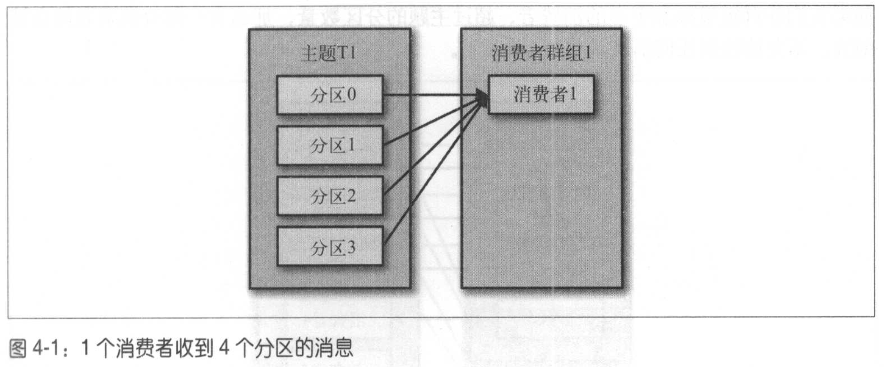

# 4. Kafka消费者 - 从Kafka读取数据

## 4.1 KafkaConsumer概念

### 4.1.1 消费者和消费者群组

 - 如果想读取Kafka的数据，必须：
  1. 创建一个消费者对象
  2. 订阅主题并开始接收消息
  3. 验证消息并保存结果

 - 可以对消费者进行**横向伸缩**，使得多个消费者从同一个主题读取消息
 - Kafka消费者属于**消费者群组**
   - 一个群组的消费者订阅的是同一个主题
   - 每个消费者接收主题一部分分区的消息

 - 假设主题T1有4个分区，我们创建了消费者C1，它是群组G1的唯一的消费者，我们用它订阅主题T1。消费者C1将收到主题T1全部4个分区的消息。

 

  - 如果在群组G1添加一个消费者C2，那么每个消费者将分别从两个分区接收消息：


 - 如果群组G1有4个消费者，每个消费者可以分配到一个分区：

 

 - 如果消费者数量超过主题分区数量，多出来的消费者会被闲置（idle），不会接收任何消息：


**横向伸缩消费者能力**

 - 主要增加横向伸缩消费者能力的方式是在群组里增加消费者
 - 必要时，需要创建大量的分区，在负载增加时加入更多的消费者
 - 不过注意，如过消费者数量大于主题分区数量，多余的消费者会被闲置

**多个应用程序读取同一个主题**

 - 有时候，多个应用程序会读取同一个主题，此时，就要保证每个程序有自己的消费者群组。
 - 接着上面的*例子*，如果新增一个消费群组G2，那么这个消费群组将从主题T1上接收所有消息，与群组G1互不影响。


### 4.1.2 消费者群组和分区再均衡

**增加及减少消费者**

 - 一个新的消费者加入群组时，它读取的是原本由其他消费者读取的信息
 - 当一个消费者被关闭或发生崩塌时，他就离开群组，原本由它处理的分区也会被分配到群组的其他消费者

**再均衡**

 - 在主题变化时，比如添加了分区， 会发生分区重新分配，这也被称为**再均衡**。
 - 在再均衡期间，消费者无法读取消息，造成群组一小时间的不可用
 - 当分区被分配到另一个消费者时，消费者当前的读取状态会丢失，他有可能需要去刷新缓存，在他重新恢复之前会拖慢应用程序。

**群组协调器及心跳**

 - 消费者通过被指派为**群组协调器**的broker发送**心跳**来*维持他们和群组的从属关系*以及他们对*分区的所有权利*。
 - 只要消费者在正常时间内发送心跳，就会被认定为活跃，因此可证明他们还在读取分区的消息
 - 消费者会在轮询消息（为了获取消息）或提交偏移量时发送心跳
 - 如果消费者停止发送心跳时间过长，会被认定为死亡，因此触发再均衡。

## 4.2 创建Kafka消费者

 - 跟创造生产者很类似，创建消费者时，需要把想传递到消费者的属性放在properties对象里。
 - 有4个必要属性：
  1. `bootstrap.servers`：指定了Kafka集群的连接字符串
  2, 3. `key.deserializer`和`value.deserializer`：与生产者的serializer差不多；把字节数组转成Java对象
  4. `group.id`：指定了KafkaConsumer属于哪一个消费群组

```cpp
Properties props = new Properties();
props.put("bootstrap.servers", "broker1:9092,broker2:9092");
props.put("group.id", "CountryCounter");
props.put("key.deserializer", "org.apache.kafka.common.serialization.StringDeserializer");
props.put("value.deserializer", "org.apache.kafka.common.serialization.StringDeserializer");
KafkaConsumer<String,String> consumer = new KafkaConsumer<String,String>(props);
```

## 4.3 订阅主题

 - `subscribe()`方法接收一个主题列表作为参数：
```java
consumer.subscribe(Collections.singletonList("customerCountries"));
```

 - 也可以传入一个正则表达式（Regular Expression）
 - 比如：订阅test相关的主题可以这样：
```java
consumer.subscribe("test.*");
```

## 4.4 轮询（Pooling）

 - 一旦消费者订阅主题，轮询就会处理所有的细节（包括群组协调，分区再均衡，发送心跳和获取数据）
 - 开发者只需要使用一组API来处理从分区返回的数据

```java
try{
  while(true){
    ConsumerRecords<String, String> records = consumer.poll(100); // [1,2]
    for(ConsumerRecord<String, String> record : records){
      log.debug("topic = %s, partition = %s, offset = %d, customer = %s, country = %s\n",
        record.topic(), record.partition(), record.offset(),
        record.key(), record.value());
      
      int updatedCount = 1;
      if(cusCountryMap.containsValue(record.value())){
        updatedCount = custCountryMap.get(record.value()) + 1;
      }
      cusCountryMap.put(record.value(), updatedCount);
      
      JSONObject json = new JSONObject(custCountryMap);
      System.out.println(json.toString(4));
    }
  }
} finally {
  consumer.close(); // [3]
}
```

 - [1] 消费者必须持续对Kafka进行轮询，否则会被认定为死亡（然后他的分区会被分到其他消费者）；
 - [2] 传给`poll`方法的参数是一个**超时时间**，由于控制该的阻塞时间
   - 如果设为0，poll()立刻返回，否者他会在指定的毫秒数内等待broker返回数据
   - 该方法返回一个记录列表
 - [3] 推出程序之前必须使用`close()`把网络连接和socket关闭，并立刻触发一次再均衡
   - 而不是等待群组协调器发现不再法心跳；因为这样需要的时间比较长

**第一次使用poll**
 - 在第一次使用poll方法时，他会负责找GroupCoordinator，然后加入群组，接收分配的分区

## 4.5 消费者的配置

TODO: skip for now

## 4.6 提交和偏移量

 - Kafka不像其他JMS队列那样需要得到消费者的确认
 - 消费者可更新分区当前的位子（偏移量）来达到同样的效果；这个操作叫作**提交**。
   - 每次使用poll，总是返回偏移量对应的消息

**具体如何提交？**
 - 消费者往一个叫作`_consumer_offset`的特殊主题发送消息，消息里包含每个分区的偏移量。
 - 当消费者一直处于运行状态，偏移量就没有什么用处
 - 但如果消费者发生崩塌或者有新的消费者入群组，就会触发再均衡，完成再均衡后，每个消费者可能分配到新的分区，而不是之前处理那个。此时，消费者需要读取每个分区最后一次提交的偏移量，继续工作

**提交的偏移量与客户端处理的最后一个消息的偏移量**

 - 如果 (提交的偏移量) < (客户端处理的最后一个消息的偏移量)，那么处理两个偏移量之间的消息就会被重复处理
   - 可以通过修改提交时间间隔来更频繁地提交偏移量，较少可能出现重复消息的时间窗；不过这种情况是无法完全避免的

 

  - 如果 (提交的偏移量) > (客户端处理的最后一个消息的偏移量)，那么处理两个偏移量之间的消息就会丢失：

 

### 4.6.1 自动提交
 
 - 最简单的提交方式是让消费者自动提交偏移量
   - 如果enable.auto.commit被设为true，那么每过5秒，消费者会自动把poll方法接收到的最大偏移量提交上去
 - 消费者每次进行轮询时会检查是否该提交偏移量

### 4.6.2 提交当前偏移量

 - 可以把`auto.commit.offset`设为false来手动提交，而不是基于时间间隔
 - 然后，使用`commitSync()`提交偏移量最简单也最可靠
   - 这个API会提交由`poll()`返回的最新偏移量，提交成功后马上返回，如果提交失败就抛出异常
 - 在成功提交或碰到无法恢复的错误时，会重试

```java
while(true){
  ConsumerRecords<String, String> records = consumer.poll(100);
  for(ConsumerRecord<String, String> record : records){
    System.out.printf("topic = %s, partition = %s, customer = %s, country = %s", 
      record.topic(), record.partition(), record.key(), record.value());
  }
  try {
    consumer.commitSync();
  } catch(Exception e){
    log.error("commit failed", e);
  }
}
```

### 4.6.3 异步提交

 - 使用上面的方法有一个问题，在broker对提交请求作出回应之前，应用程序会一直阻塞，这样会**影响程序的吞吐量**。
 - 这个时候，我们可以使用异步提交API，`consumer.commitAsync()`。我们只发送提交请求，无需等broker的响应。

```java
while(true){
  ConsumerRecords<String, String> records = consumer.poll(100);
  for(ConsumerRecord<String, String> record : records){
    System.out.printf("topic = %s, partition = %s, customer = %s, country = %s", 
      record.topic(), record.partition(), record.key(), record.value());
  }
  consumer.commitAsync();
}
```

 - 但这个API不会重试
   - 因为在它收到服务器响应的时候，可能有一个更大的偏移量已经提交成功了
   - 原因是如果重试的话，可能会出现offset 3000先commit了，然后重试的offset 2000才到，这时候就会重复消费了。（即commit order问题）
   - 所以**是否sync/async，是一种reliable-throughout的权衡**
     - 一般大数据还是高吞吐更重要
     - reliable可以同步业务系统的幂等性达到。

**async回调（callback）**
 - commitAsync()也支持回调
```java
consumer.commitAsync(new OffsetCommitCallback(){
  public void onComplete(Map<TopicPartition, OffsetAndMetadata> offsets, Exception e){
    if(e != null){
      log.error("Commit failed for offsets {}", offsets, e);
    }
  }
});
```

**重试异步提交**

 - 我们可以使用给一个单调递增的序列号来维护异步提交的顺序。
 - 在每次提交偏移量之后或在回调里提交偏移量时递增序列号
 - 在进行重试前，先检查回调的序列号和即将提交的偏移量是否相等，如果相等，说明没有新的提交，那么可以安全地进行重试
 - 如果序列号比较大，说明有一个新的提交已经发送出去了，应该停止重试。

### 4.6.4 同步和异步组合提交

 - 一般情况下，不重试也不是太大的问题，因为通常都是临时的问题；后续的提交总是会成功的。
 - 但如果这个情况发生在关闭消费者或再均衡前的最后一次提交，那就要确保提交成功
 - 为了这问题，我们可以组合使用`commitAsync()`和`commitSync()`：

```java
try{
  while(true){
    ConsumerRecords<String, String> records = consumer.poll(100);
    for(ConsumerRecord<String, String> record : records) {
      System.out.printf("topic = %s, partition = %s, customer = %s, country = %s", 
      record.topic(), record.partition(), record.key(), record.value());
      consumer.commitAsync(); // 如果成功，这样速度比较快。即使这次失败，下一次提交很可能成功。
    }
  }
} catch (Exception e){
  log.error("Unexpected error ", e);
} finally {
  try {
    consumer.commitSync(); // 如果直接关闭消费者，就没有“下一次提交“。使用commitSync()方法会一直重试，知道提交成功或发生无法恢复的错误
  } finally {
    consumer.close();
  }
}
```

### 4.6.5 提交特定的偏移量

 - 有时候，我们想在批次中间提交偏移量
 - 可以在调用`commitAsync()`和`commitSync()`方法时传进去希望提交的分区和偏移量的map
 - 因为消费者可能不只读取一个分区，你需要跟踪所有分区的偏移量

```java
private Map<TopicPartition, OffsetAndMetadata> currentOffsets = new HashMap<>();
int count = 0;

while(true){
  ConsumerRecords<String, String> records = consumer.poll(100);
  for(ConsumerRecord<String, String> record : records) {
    ...
    currentOffsets.put(
      new TopicPartition(record.topic(), record.partition()), 
      new OffsetAndMetadata(record.offset() + 1, "no metadata")
    );
    if(count % 100 == 0){ // 每处理100个消息，就提交偏移量
      consumer.commitAsync(currentOffsets, null); // 可以转成commitSync
    }
    count++;
  }
}
```

## 4.7 再均衡监听器


https://zhuanlan.zhihu.com/p/27408881
